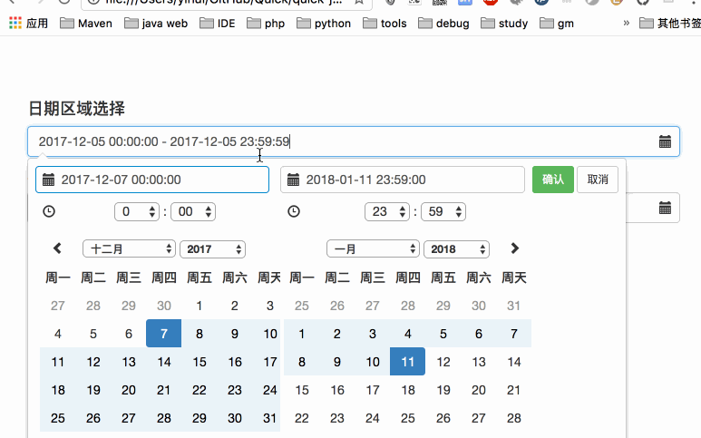
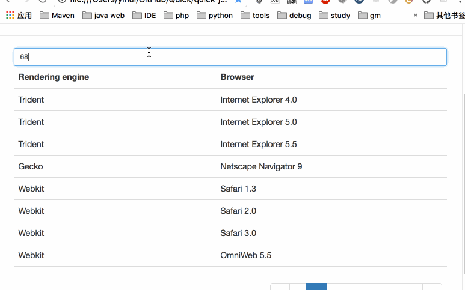
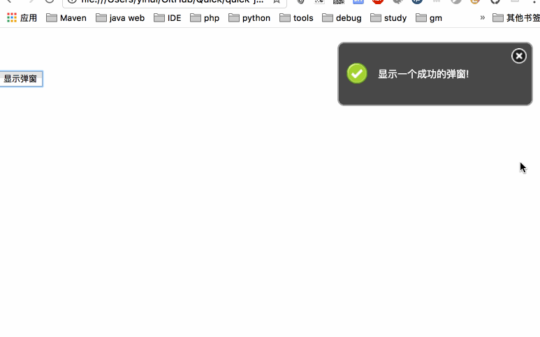

# quick-jsdemo
> 主要记录一个纯后端蛋疼的写前端页面的历程，会将一些用到的插件汇总，以方便以后复用

## 声明

基本上所有的控件都是采用开源的库，有些不知道来源了，单反清楚的都给出了源地址链接

## 汇总

### 1. 日期控件

主要利用的 `datarangepicker`, 支持开始时间到结束时间的选择，有丰富的配置项，基本上可以满足各种姿势的需求，好用不复杂

详细使用可以参考: [日期控件使用说明](views/datepicker/readme.md)

演示demo ： 

### 2. 可搜索表格控件

这个表哥的内容支持实时过滤检索，当表格中有大量的数据时，可以利用这个，负责一个搜索框，实现实时过滤检索

详细使用说明: [搜索table使用说明](views/tablesearch/readme.md)

演示demo: 

### 3. toast弹框

通知消息

详细使用说明: [toast使用说明](views/toast/readme.md)

演示demo: 

### 4. markdown富文本编辑

markdown视图

详细使用说明 : [markdown使用说明](views/markdown/readme.md)
